# Migration Plan: localStorage to Supabase (Anonymous-First)

## Overview
This document outlines the complete migration strategy for transitioning a React TypeScript todo app from browser localStorage to Supabase cloud storage. The approach uses a device-based anonymous system that allows users to start using cloud-synced todos immediately, with the ability to upgrade to a full account later for cross-device synchronization.

## Key Benefits
- **Persistent cloud storage** - Data survives browser clears
- **Cross-device synchronization** - Access todos from any device (after authentication)
- **Real-time updates** - See changes across multiple tabs/devices
- **Scalability** - No storage limits
- **Zero friction start** - Users can immediately use cloud-synced todos
- **Offline support** - Works without internet connection

## Architecture Overview

```mermaid
graph TB
    subgraph "Phase 1: Anonymous Users"
        A1[React App] --> B1[Device ID Manager]
        B1 --> C1[Supabase Service]
        C1 --> D1[Supabase DB]
        D1 --> E1[Todos with device_id]
        
        B1 --> F1[localStorage deviceId]
    end
    
    subgraph "Phase 2: Authenticated Users"
        A2[React App] --> B2[Auth Service]
        B2 --> C2[Supabase Auth]
        C2 --> D2[Supabase DB]
        D2 --> E2[Todos with user_id]
        
        B2 --> M2[Migration Service]
        M2 --> N2[Convert device_id → user_id]
    end
    
    subgraph "Offline Support"
        O1[Offline Queue] --> P1[localStorage backup]
        P1 --> Q1[Sync when online]
    end
    
    style A1 fill:#9f9,stroke:#333,stroke-width:2px
    style A2 fill:#99f,stroke:#333,stroke-width:2px
```



## Phase 1: Setup and Database Design

### 1.1 Supabase Project Setup
```bash
# Install dependencies
npm install @supabase/supabase-js
npm install uuid  # For device ID generation
```

### 1.2 Database Schema (Anonymous-First)
```sql
-- Create todos table with dual ownership support
CREATE TABLE todos (
  id UUID DEFAULT gen_random_uuid() PRIMARY KEY,
  text TEXT NOT NULL,
  completed BOOLEAN DEFAULT false,
  created_at TIMESTAMP WITH TIME ZONE DEFAULT NOW(),
  updated_at TIMESTAMP WITH TIME ZONE DEFAULT NOW(),
  
  -- Ownership fields
  device_id TEXT,
  user_id UUID REFERENCES auth.users(id),
  
  -- Ensure exactly one owner type
  CONSTRAINT single_owner CHECK (
    (user_id IS NOT NULL AND device_id IS NULL) OR
    (user_id IS NULL AND device_id IS NOT NULL)
  )
);

-- Indexes for performance
CREATE INDEX idx_todos_device_id ON todos(device_id) WHERE device_id IS NOT NULL;
CREATE INDEX idx_todos_user_id ON todos(user_id) WHERE user_id IS NOT NULL;
CREATE INDEX idx_todos_created_at ON todos(created_at DESC);

-- Updated_at trigger
CREATE OR REPLACE FUNCTION update_updated_at_column()
RETURNS TRIGGER AS $$
BEGIN
  NEW.updated_at = NOW();
  RETURN NEW;
END;
$$ language 'plpgsql';

CREATE TRIGGER update_todos_updated_at BEFORE UPDATE ON todos
  FOR EACH ROW EXECUTE FUNCTION update_updated_at_column();

-- Enable RLS
ALTER TABLE todos ENABLE ROW LEVEL SECURITY;

-- Anonymous access policy (using custom header)
CREATE POLICY "Anonymous device access" ON todos
  FOR ALL 
  USING (
    device_id IS NOT NULL AND
    device_id = coalesce(
      current_setting('request.headers', true)::json->>'x-device-id',
      ''
    )
  );

-- Authenticated user access policy
CREATE POLICY "Authenticated user access" ON todos
  FOR ALL 
  USING (
    user_id IS NOT NULL AND
    auth.uid() = user_id
  );

-- Migration table to track device->user migrations
CREATE TABLE device_migrations (
  id UUID DEFAULT gen_random_uuid() PRIMARY KEY,
  device_id TEXT NOT NULL,
  user_id UUID NOT NULL REFERENCES auth.users(id),
  migrated_at TIMESTAMP WITH TIME ZONE DEFAULT NOW(),
  todos_count INTEGER DEFAULT 0
);

-- Function to migrate todos from device to user
CREATE OR REPLACE FUNCTION migrate_device_todos(
  p_device_id TEXT,
  p_user_id UUID
) RETURNS INTEGER AS $$
DECLARE
  migrated_count INTEGER;
BEGIN
  -- Update todos ownership
  UPDATE todos 
  SET user_id = p_user_id, 
      device_id = NULL,
      updated_at = NOW()
  WHERE device_id = p_device_id;
  
  GET DIAGNOSTICS migrated_count = ROW_COUNT;
  
  -- Log migration
  INSERT INTO device_migrations (device_id, user_id, todos_count)
  VALUES (p_device_id, p_user_id, migrated_count);
  
  RETURN migrated_count;
END;
$$ LANGUAGE plpgsql SECURITY DEFINER;
```

## Phase 2: Core Services Implementation

### 2.1 Environment Configuration
```env
# .env.local
REACT_APP_SUPABASE_URL=your-project-url
REACT_APP_SUPABASE_ANON_KEY=your-anon-key
```

### 2.2 Type Definitions
```typescript
// src/types.ts
export interface Todo {
  id: string;
  text: string;
  completed: boolean;
  createdAt: Date;
  updatedAt?: Date;
  syncStatus?: 'synced' | 'pending' | 'error';
}

export type FilterType = 'all' | 'active' | 'completed';
```

### 2.3 Device ID Management
```typescript
// src/services/deviceService.ts
import { v4 as uuidv4 } from 'uuid';

export class DeviceService {
  private static DEVICE_ID_KEY = 'todo_device_id';
  
  static getDeviceId(): string {
    let deviceId = localStorage.getItem(this.DEVICE_ID_KEY);
    if (!deviceId) {
      deviceId = `device_${uuidv4()}`;
      localStorage.setItem(this.DEVICE_ID_KEY, deviceId);
    }
    return deviceId;
  }
  
  static clearDeviceId(): void {
    localStorage.removeItem(this.DEVICE_ID_KEY);
  }
  
  static hasDeviceId(): boolean {
    return !!localStorage.getItem(this.DEVICE_ID_KEY);
  }
}
```

### 2.4 Supabase Client Configuration
```typescript
// src/config/supabase.ts
import { createClient } from '@supabase/supabase-js';
import { DeviceService } from '../services/deviceService';

const supabaseUrl = process.env.REACT_APP_SUPABASE_URL!;
const supabaseAnonKey = process.env.REACT_APP_SUPABASE_ANON_KEY!;

// Create client with custom headers for device ID
export const supabase = createClient(supabaseUrl, supabaseAnonKey, {
  global: {
    headers: {
      'x-device-id': DeviceService.getDeviceId()
    }
  }
});

// Function to update headers after auth changes
export const updateSupabaseHeaders = () => {
  const deviceId = DeviceService.hasDeviceId() ? DeviceService.getDeviceId() : '';
  supabase.rest.headers['x-device-id'] = deviceId;
};
```

### 2.5 Supabase Service Layer
```typescript
// src/services/supabaseService.ts
import { supabase } from '../config/supabase';
import { Todo } from '../types';
import { DeviceService } from './deviceService';

interface SupabaseTodo {
  id: string;
  text: string;
  completed: boolean;
  created_at: string;
  updated_at: string;
  device_id?: string;
  user_id?: string;
}

export class SupabaseService {
  private static convertToTodo(supabaseTodo: SupabaseTodo): Todo {
    return {
      id: supabaseTodo.id,
      text: supabaseTodo.text,
      completed: supabaseTodo.completed,
      createdAt: new Date(supabaseTodo.created_at),
      updatedAt: new Date(supabaseTodo.updated_at)
    };
  }
  
  static async getTodos(): Promise<Todo[]> {
    const { data: { user } } = await supabase.auth.getUser();
    
    let query = supabase.from('todos').select('*');
    
    if (user) {
      query = query.eq('user_id', user.id);
    } else {
      query = query.eq('device_id', DeviceService.getDeviceId());
    }
    
    const { data, error } = await query.order('created_at', { ascending: false });
    
    if (error) throw error;
    return (data || []).map(this.convertToTodo);
  }
  
  static async createTodo(text: string): Promise<Todo> {
    const { data: { user } } = await supabase.auth.getUser();
    
    const todoData = {
      text,
      completed: false,
      ...(user ? { user_id: user.id } : { device_id: DeviceService.getDeviceId() })
    };
    
    const { data, error } = await supabase
      .from('todos')
      .insert(todoData)
      .select()
      .single();
    
    if (error) throw error;
    return this.convertToTodo(data);
  }
  
  static async updateTodo(id: string, updates: Partial<Todo>): Promise<Todo> {
    const { data, error } = await supabase
      .from('todos')
      .update({
        text: updates.text,
        completed: updates.completed
      })
      .eq('id', id)
      .select()
      .single();
    
    if (error) throw error;
    return this.convertToTodo(data);
  }
  
  static async deleteTodo(id: string): Promise<void> {
    const { error } = await supabase
      .from('todos')
      .delete()
      .eq('id', id);
    
    if (error) throw error;
  }
  
  static subscribeToTodos(callback: (todos: Todo[]) => void): () => void {
    const { data: { user } } = supabase.auth.getUser();
    
    const channel = supabase
      .channel('todos_changes')
      .on(
        'postgres_changes',
        {
          event: '*',
          schema: 'public',
          table: 'todos',
          filter: user 
            ? `user_id=eq.${user.id}`
            : `device_id=eq.${DeviceService.getDeviceId()}`
        },
        async () => {
          const todos = await this.getTodos();
          callback(todos);
        }
      )
      .subscribe();
    
    return () => {
      supabase.removeChannel(channel);
    };
  }
}
```

## Phase 3: Migration and Offline Support

### 3.1 Migration Service
```typescript
// src/services/migrationService.ts
import { loadTodos, clearTodos } from '../utils/localStorage';
import { SupabaseService } from './supabaseService';
import { DeviceService } from './deviceService';
import { supabase, updateSupabaseHeaders } from '../config/supabase';

export class MigrationService {
  static async migrateFromLocalStorage(): Promise<void> {
    try {
      const localTodos = loadTodos();
      if (localTodos.length === 0) return;
      
      console.log(`Migrating ${localTodos.length} todos to Supabase...`);
      
      // Create todos in Supabase
      for (const todo of localTodos) {
        await SupabaseService.createTodo(todo.text);
        // If todo was completed, update it
        if (todo.completed) {
          await SupabaseService.updateTodo(todo.id, { completed: true });
        }
      }
      
      // Clear localStorage after successful migration
      clearTodos();
      console.log('Migration completed successfully');
    } catch (error) {
      console.error('Migration failed:', error);
      throw error;
    }
  }
  
  static async migrateDeviceToUser(userId: string): Promise<void> {
    const deviceId = DeviceService.getDeviceId();
    
    const { data, error } = await supabase.rpc('migrate_device_todos', {
      p_device_id: deviceId,
      p_user_id: userId
    });
    
    if (error) throw error;
    
    // Clear device ID after successful migration
    DeviceService.clearDeviceId();
    updateSupabaseHeaders();
    
    console.log(`Migrated ${data} todos to user account`);
  }
}
```

### 3.2 Offline Queue Service
```typescript
// src/services/offlineQueueService.ts
import { SupabaseService } from './supabaseService';

interface QueuedOperation {
  id: string;
  type: 'create' | 'update' | 'delete';
  timestamp: number;
  data: any;
  retries: number;
}

export class OfflineQueueService {
  private static QUEUE_KEY = 'todo_offline_queue';
  private static MAX_RETRIES = 3;
  
  static addToQueue(operation: Omit<QueuedOperation, 'id' | 'timestamp' | 'retries'>): void {
    const queue = this.getQueue();
    queue.push({
      ...operation,
      id: `queue_${Date.now()}_${Math.random()}`,
      timestamp: Date.now(),
      retries: 0
    });
    this.saveQueue(queue);
  }
  
  static async processQueue(): Promise<void> {
    const queue = this.getQueue();
    const failedOps: QueuedOperation[] = [];
    
    for (const op of queue) {
      try {
        await this.processOperation(op);
      } catch (error) {
        op.retries++;
        if (op.retries < this.MAX_RETRIES) {
          failedOps.push(op);
        }
      }
    }
    
    this.saveQueue(failedOps);
  }
  
  private static async processOperation(op: QueuedOperation): Promise<void> {
    switch (op.type) {
      case 'create':
        await SupabaseService.createTodo(op.data.text);
        break;
      case 'update':
        await SupabaseService.updateTodo(op.data.id, op.data.updates);
        break;
      case 'delete':
        await SupabaseService.deleteTodo(op.data.id);
        break;
    }
  }
  
  private static getQueue(): QueuedOperation[] {
    const data = localStorage.getItem(this.QUEUE_KEY);
    return data ? JSON.parse(data) : [];
  }
  
  private static saveQueue(queue: QueuedOperation[]): void {
    localStorage.setItem(this.QUEUE_KEY, JSON.stringify(queue));
  }
}
```

### 3.3 Updated localStorage Utilities
```typescript
// src/utils/localStorage.ts (add this function)
export const clearTodos = (): void => {
  localStorage.removeItem(TODOS_KEY);
};
```

## Phase 4: Component Updates

### 4.1 Connection Status Component
```typescript
// src/components/ConnectionStatus.tsx
import React from 'react';

interface ConnectionStatusProps {
  isOnline: boolean;
  syncStatus: 'synced' | 'syncing' | 'error';
}

const ConnectionStatus: React.FC<ConnectionStatusProps> = ({ isOnline, syncStatus }) => {
  if (!isOnline) {
    return (
      <div className="connection-status offline">
        <span className="status-icon">🔴</span>
        <span>Offline - Changes will sync when reconnected</span>
      </div>
    );
  }
  
  if (syncStatus === 'syncing') {
    return (
      <div className="connection-status syncing">
        <span className="status-icon">🔄</span>
        <span>Syncing...</span>
      </div>
    );
  }
  
  if (syncStatus === 'error') {
    return (
      <div className="connection-status error">
        <span className="status-icon">⚠️</span>
        <span>Sync error - Will retry</span>
      </div>
    );
  }
  
  return null; // Don't show anything when synced
};

export default ConnectionStatus;
```

### 4.2 Auth Prompt Component
```typescript
// src/components/AuthPrompt.tsx
import React from 'react';

interface AuthPromptProps {
  onDismiss: () => void;
}

const AuthPrompt: React.FC<AuthPromptProps> = ({ onDismiss }) => {
  return (
    <div className="auth-prompt">
      <div className="auth-prompt-content">
        <h3>🔄 Sync Across All Your Devices</h3>
        <p>Create a free account to access your todos from anywhere!</p>
        <div className="auth-prompt-benefits">
          <div>✓ Access from any device</div>
          <div>✓ Never lose your todos</div>
          <div>✓ Free forever</div>
        </div>
        <div className="auth-prompt-actions">
          <button className="btn-primary" onClick={() => {/* Navigate to auth */}}>
            Create Account
          </button>
          <button className="btn-secondary" onClick={onDismiss}>
            Maybe Later
          </button>
        </div>
      </div>
    </div>
  );
};

export default AuthPrompt;
```

### 4.3 Updated App Component
```typescript
// src/App.tsx
import React, { useState, useEffect } from 'react';
import { Todo, FilterType } from './types';
import { SupabaseService } from './services/supabaseService';
import { MigrationService } from './services/migrationService';
import { OfflineQueueService } from './services/offlineQueueService';
import TodoInput from './components/TodoInput';
import TodoList from './components/TodoList';
import FilterButtons from './components/FilterButtons';
import ConnectionStatus from './components/ConnectionStatus';
import AuthPrompt from './components/AuthPrompt';
import './App.css';

function App() {
  const [todos, setTodos] = useState<Todo[]>([]);
  const [filter, setFilter] = useState<FilterType>('all');
  const [loading, setLoading] = useState(true);
  const [isOnline, setIsOnline] = useState(navigator.onLine);
  const [syncStatus, setSyncStatus] = useState<'synced' | 'syncing' | 'error'>('synced');
  const [showAuthPrompt, setShowAuthPrompt] = useState(false);

  // Initialize and migrate data
  useEffect(() => {
    const initializeApp = async () => {
      try {
        // Check for localStorage data to migrate
        await MigrationService.migrateFromLocalStorage();
        
        // Load todos from Supabase
        const supabaseTodos = await SupabaseService.getTodos();
        setTodos(supabaseTodos);
        
        // Process any offline queue
        if (navigator.onLine) {
          await OfflineQueueService.processQueue();
        }
      } catch (error) {
        console.error('Failed to initialize:', error);
      } finally {
        setLoading(false);
      }
    };
    
    initializeApp();
  }, []);

  // Set up real-time subscription
  useEffect(() => {
    const unsubscribe = SupabaseService.subscribeToTodos((newTodos) => {
      setTodos(newTodos);
    });
    
    return () => {
      unsubscribe();
    };
  }, []);

  // Monitor online/offline status
  useEffect(() => {
    const handleOnline = async () => {
      setIsOnline(true);
      setSyncStatus('syncing');
      try {
        await OfflineQueueService.processQueue();
        const todos = await SupabaseService.getTodos();
        setTodos(todos);
        setSyncStatus('synced');
      } catch (error) {
        setSyncStatus('error');
      }
    };
    
    const handleOffline = () => {
      setIsOnline(false);
    };
    
    window.addEventListener('online', handleOnline);
    window.addEventListener('offline', handleOffline);
    
    return () => {
      window.removeEventListener('online', handleOnline);
      window.removeEventListener('offline', handleOffline);
    };
  }, []);

  // Check if we should show auth prompt
  useEffect(() => {
    const checkAuthPrompt = () => {
      const todoCount = todos.length;
      const hasShownPrompt = localStorage.getItem('auth_prompt_shown');
      
      if (todoCount >= 10 && !hasShownPrompt) {
        setShowAuthPrompt(true);
        localStorage.setItem('auth_prompt_shown', 'true');
      }
    };
    
    checkAuthPrompt();
  }, [todos]);

  const addTodo = async (text: string) => {
    try {
      if (isOnline) {
        const newTodo = await SupabaseService.createTodo(text);
        setTodos([newTodo, ...todos]);
      } else {
        // Optimistic update for offline
        const tempTodo: Todo = {
          id: `temp_${Date.now()}`,
          text,
          completed: false,
          createdAt: new Date(),
          syncStatus: 'pending'
        };
        setTodos([tempTodo, ...todos]);
        OfflineQueueService.addToQueue({ type: 'create', data: { text } });
      }
    } catch (error) {
      console.error('Failed to add todo:', error);
    }
  };

  const toggleTodo = async (id: string) => {
    try {
      const todo = todos.find(t => t.id === id);
      if (!todo) return;
      
      if (isOnline && !id.startsWith('temp_')) {
        await SupabaseService.updateTodo(id, { completed: !todo.completed });
      } else {
        // Optimistic update
        setTodos(todos.map(t => 
          t.id === id ? { ...t, completed: !t.completed, syncStatus: 'pending' } : t
        ));
        
        if (!id.startsWith('temp_')) {
          OfflineQueueService.addToQueue({ 
            type: 'update', 
            data: { id, updates: { completed: !todo.completed } }
          });
        }
      }
    } catch (error) {
      console.error('Failed to toggle todo:', error);
    }
  };

  const deleteTodo = async (id: string) => {
    try {
      if (isOnline && !id.startsWith('temp_')) {
        await SupabaseService.deleteTodo(id);
      } else {
        // Optimistic update
        setTodos(todos.filter(t => t.id !== id));
        
        if (!id.startsWith('temp_')) {
          OfflineQueueService.addToQueue({ type: 'delete', data: { id } });
        }
      }
    } catch (error) {
      console.error('Failed to delete todo:', error);
    }
  };

  const editTodo = async (id: string, newText: string) => {
    try {
      if (isOnline && !id.startsWith('temp_')) {
        await SupabaseService.updateTodo(id, { text: newText });
      } else {
        // Optimistic update
        setTodos(todos.map(t => 
          t.id === id ? { ...t, text: newText, syncStatus: 'pending' } : t
        ));
        
        if (!id.startsWith('temp_')) {
          OfflineQueueService.addToQueue({ 
            type: 'update', 
            data: { id, updates: { text: newText } }
          });
        }
      }
    } catch (error) {
      console.error('Failed to edit todo:', error);
    }
  };

  const todoCount = {
    all: todos.length,
    active: todos.filter(todo => !todo.completed).length,
    completed: todos.filter(todo => todo.completed).length
  };

  if (loading) {
    return (
      <div className="App">
        <div className="loading-container">
          <div className="spinner"></div>
          <p>Loading your todos...</p>
        </div>
      </div>
    );
  }

  return (
    <div className="App">
      <ConnectionStatus isOnline={isOnline} syncStatus={syncStatus} />
      
      <div className="todo-container">
        <header className="app-header">
          <h1>Todo App</h1>
          <p>Stay organized and get things done!</p>
        </header>
        
        <main className="app-main">
          {showAuthPrompt && (
            <AuthPrompt onDismiss={() => setShowAuthPrompt(false)} />
          )}
          
          <TodoInput onAddTodo={addTodo} />
          
          {todos.length > 0 && (
            <FilterButtons
              currentFilter={filter}
              onFilterChange={setFilter}
              todoCount={todoCount}
            />
          )}
          
          <TodoList
            todos={todos}
            filter={filter}
            onToggle={toggleTodo}
            onDelete={deleteTodo}
            onEdit={editTodo}
          />
        </main>
      </div>
    </div>
  );
}

export default App;
```

### 4.4 CSS Updates
```css
/* Add to App.css */

/* Loading state */
.loading-container {
  display: flex;
  flex-direction: column;
  align-items: center;
  justify-content: center;
  min-height: 100vh;
  gap: 1rem;
}

.spinner {
  width: 40px;
  height: 40px;
  border: 4px solid #f3f3f3;
  border-top: 4px solid #3498db;
  border-radius: 50%;
  animation: spin 1s linear infinite;
}

@keyframes spin {
  0% { transform: rotate(0deg); }
  100% { transform: rotate(360deg); }
}

/* Connection status */
.connection-status {
  position: fixed;
  top: 0;
  left: 0;
  right: 0;
  padding: 0.5rem;
  text-align: center;
  font-size: 0.875rem;
  z-index: 1000;
  display: flex;
  align-items: center;
  justify-content: center;
  gap: 0.5rem;
}

.connection-status.offline {
  background-color: #f44336;
  color: white;
}

.connection-status.syncing {
  background-color: #ff9800;
  color: white;
}

.connection-status.error {
  background-color: #f44336;
  color: white;
}

.status-icon {
  font-size: 1rem;
}

/* Auth prompt */
.auth-prompt {
  background-color: #e3f2fd;
  border: 1px solid #2196f3;
  border-radius: 8px;
  padding: 1.5rem;
  margin-bottom: 1.5rem;
}

.auth-prompt-content h3 {
  margin: 0 0 0.5rem 0;
  color: #1976d2;
}

.auth-prompt-benefits {
  margin: 1rem 0;
  display: flex;
  flex-direction: column;
  gap: 0.5rem;
  color: #555;
}

.auth-prompt-actions {
  display: flex;
  gap: 1rem;
  margin-top: 1rem;
}

.btn-primary {
  background-color: #2196f3;
  color: white;
  border: none;
  padding: 0.5rem 1.5rem;
  border-radius: 4px;
  cursor: pointer;
  font-size: 1rem;
}

.btn-primary:hover {
  background-color: #1976d2;
}

.btn-secondary {
  background-color: transparent;
  color: #2196f3;
  border: 1px solid #2196f3;
  padding: 0.5rem 1.5rem;
  border-radius: 4px;
  cursor: pointer;
  font-size: 1rem;
}

.btn-secondary:hover {
  background-color: #e3f2fd;
}

/* Sync status indicators on todos */
.todo-item.pending {
  opacity: 0.7;
  position: relative;
}

.todo-item.pending::after {
  content: '⏳';
  position: absolute;
  right: 10px;
  top: 50%;
  transform: translateY(-50%);
  font-size: 0.875rem;
}
```

## Phase 5: Testing Strategy

### 5.1 Unit Tests
- Test DeviceService methods
- Test SupabaseService CRUD operations
- Test OfflineQueueService functionality
- Test MigrationService

### 5.2 Integration Tests
- Test localStorage to Supabase migration
- Test offline/online transitions
- Test real-time synchronization
- Test device to user migration

### 5.3 E2E Test Scenarios
1. **New User Flow**
   - User creates todos anonymously
   - Todos persist across page refreshes
   - User creates account
   - Todos migrate to user account

2. **Offline Usage**
   - User goes offline
   - Creates/edits/deletes todos
   - Goes back online
   - Changes sync to Supabase

3. **Multi-Tab Sync**
   - Open app in multiple tabs
   - Create todo in one tab
   - Verify it appears in other tabs

## Phase 6: Deployment Checklist

### 6.1 Pre-deployment
- [ ] Create Supabase project
- [ ] Run database migrations
- [ ] Set up environment variables
- [ ] Test migration from localStorage
- [ ] Test offline functionality
- [ ] Test real-time sync

### 6.2 Deployment
- [ ] Deploy application
- [ ] Monitor error logs
- [ ] Check Supabase metrics
- [ ] Verify RLS policies working

### 6.3 Post-deployment
- [ ] Monitor user adoption
- [ ] Track migration success rate
- [ ] Gather user feedback
- [ ] Plan authentication rollout

## Implementation Timeline

1. **Week 1**: Database setup, core services, migration from localStorage
2. **Week 2**: Offline support, real-time sync, connection status
3. **Week 3**: Testing, error handling, performance optimization
4. **Week 4**: Auth prompt UI, future auth preparation
5. **Future**: Full authentication, cross-device sync, sharing features

##