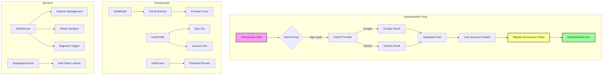

# Supabase Auth Implementation Plan: Google & GitHub OAuth

## Overview
This plan details the implementation of user authentication using Supabase Auth with Google and GitHub OAuth providers. The implementation maintains the anonymous-first approach while providing a seamless upgrade path for users to create accounts and sync their todos across devices.

## Architecture Overview



## Phase 1: Supabase Auth Configuration

### 1.1 Enable OAuth Providers in Supabase Dashboard
```yaml
Steps:
1. Navigate to Authentication > Providers in Supabase Dashboard
2. Enable Google Provider:
   - Client ID: [from Google Cloud Console]
   - Client Secret: [from Google Cloud Console]
   - Authorized redirect URIs: https://[project-ref].supabase.co/auth/v1/callback
3. Enable GitHub Provider:
   - Client ID: [from GitHub OAuth Apps]
   - Client Secret: [from GitHub OAuth Apps]
   - Authorization callback URL: https://[project-ref].supabase.co/auth/v1/callback
```

### 1.2 Environment Variables
```env
# .env.local (add these)
REACT_APP_SUPABASE_URL=your-project-url
REACT_APP_SUPABASE_ANON_KEY=your-anon-key
REACT_APP_REDIRECT_URL=http://localhost:3000/auth/callback  # Dev
# REACT_APP_REDIRECT_URL=https://your-domain.com/auth/callback  # Prod
```

### 1.3 Database Schema Updates
```sql
-- Add user profile table for additional user data
CREATE TABLE user_profiles (
  id UUID REFERENCES auth.users(id) PRIMARY KEY,
  email TEXT,
  full_name TEXT,
  avatar_url TEXT,
  provider TEXT,
  created_at TIMESTAMP WITH TIME ZONE DEFAULT NOW(),
  updated_at TIMESTAMP WITH TIME ZONE DEFAULT NOW()
);

-- Enable RLS
ALTER TABLE user_profiles ENABLE ROW LEVEL SECURITY;

-- Policy for users to read/update their own profile
CREATE POLICY "Users can view own profile" ON user_profiles
  FOR SELECT USING (auth.uid() = id);

CREATE POLICY "Users can update own profile" ON user_profiles
  FOR UPDATE USING (auth.uid() = id);

-- Trigger to create profile on user signup
CREATE OR REPLACE FUNCTION public.handle_new_user()
RETURNS trigger AS $$
BEGIN
  INSERT INTO public.user_profiles (id, email, full_name, avatar_url, provider)
  VALUES (
    new.id,
    new.email,
    new.raw_user_meta_data->>'full_name',
    new.raw_user_meta_data->>'avatar_url',
    new.raw_app_meta_data->>'provider'
  );
  RETURN new;
END;
$$ LANGUAGE plpgsql SECURITY DEFINER;

CREATE TRIGGER on_auth_user_created
  AFTER INSERT ON auth.users
  FOR EACH ROW EXECUTE FUNCTION public.handle_new_user();

-- Add index for migration tracking
CREATE INDEX idx_device_migrations_user_id ON device_migrations(user_id);
```

## Phase 2: Core Authentication Service

### 2.1 Type Definitions
```typescript
// src/types/auth.ts
export interface User {
  id: string;
  email?: string;
  fullName?: string;
  avatarUrl?: string;
  provider?: 'google' | 'github';
  createdAt: Date;
}

export interface AuthState {
  user: User | null;
  loading: boolean;
  error: string | null;
}

export type AuthProvider = 'google' | 'github';
```

### 2.2 Authentication Service
```typescript
// src/services/authService.ts
import { supabase } from '../config/supabase';
import { AuthProvider, User } from '../types/auth';
import { MigrationService } from './migrationService';
import { DeviceService } from './deviceService';

export class AuthService {
  static async signInWithProvider(provider: AuthProvider): Promise<void> {
    const redirectTo = process.env.REACT_APP_REDIRECT_URL || window.location.origin;
    
    const { error } = await supabase.auth.signInWithOAuth({
      provider,
      options: {
        redirectTo,
        scopes: provider === 'github' ? 'read:user user:email' : 'email profile'
      }
    });
    
    if (error) throw error;
  }
  
  static async signOut(): Promise<void> {
    const { error } = await supabase.auth.signOut();
    if (error) throw error;
    
    // Clear any local auth state
    localStorage.removeItem('supabase.auth.token');
  }
  
  static async getCurrentUser(): Promise<User | null> {
    const { data: { user } } = await supabase.auth.getUser();
    if (!user) return null;
    
    return this.formatUser(user);
  }
  
  static onAuthStateChange(callback: (user: User | null) => void): () => void {
    const { data: { subscription } } = supabase.auth.onAuthStateChange(
      async (event, session) => {
        if (event === 'SIGNED_IN' && session?.user) {
          // Trigger migration when user signs in
          const deviceId = DeviceService.getDeviceId();
          if (deviceId) {
            try {
              await MigrationService.migrateDeviceToUser(session.user.id);
            } catch (error) {
              console.error('Failed to migrate device todos:', error);
            }
          }
          
          callback(this.formatUser(session.user));
        } else if (event === 'SIGNED_OUT') {
          callback(null);
        }
      }
    );
    
    return () => subscription.unsubscribe();
  }
  
  static async getSession() {
    const { data: { session } } = await supabase.auth.getSession();
    return session;
  }
  
  private static formatUser(supabaseUser: any): User {
    return {
      id: supabaseUser.id,
      email: supabaseUser.email,
      fullName: supabaseUser.user_metadata?.full_name || 
                supabaseUser.user_metadata?.name ||
                supabaseUser.user_metadata?.user_name,
      avatarUrl: supabaseUser.user_metadata?.avatar_url ||
                 supabaseUser.user_metadata?.picture,
      provider: supabaseUser.app_metadata?.provider,
      createdAt: new Date(supabaseUser.created_at)
    };
  }
}
```

### 2.3 Updated Supabase Configuration
```typescript
// src/config/supabase.ts (update)
import { createClient } from '@supabase/supabase-js';
import { DeviceService } from '../services/deviceService';

const supabaseUrl = process.env.REACT_APP_SUPABASE_URL!;
const supabaseAnonKey = process.env.REACT_APP_SUPABASE_ANON_KEY!;

// Create client with custom headers for device ID
export const supabase = createClient(supabaseUrl, supabaseAnonKey, {
  auth: {
    autoRefreshToken: true,
    persistSession: true,
    detectSessionInUrl: true
  },
  global: {
    headers: {
      'x-device-id': DeviceService.getDeviceId()
    }
  }
});

// Function to create a new client with updated headers
export const getSupabaseClient = () => {
  return createClient(supabaseUrl, supabaseAnonKey, {
    auth: {
      autoRefreshToken: true,
      persistSession: true,
      detectSessionInUrl: true
    },
    global: {
      headers: {
        'x-device-id': DeviceService.hasDeviceId() ? DeviceService.getDeviceId() : ''
      }
    }
  });
};
```

## Phase 3: Authentication UI Components

### 3.1 Auth Modal Component
```typescript
// src/components/AuthModal.tsx
import React, { useState } from 'react';
import { AuthService } from '../services/authService';
import { AuthProvider } from '../types/auth';
import './AuthModal.css';

interface AuthModalProps {
  isOpen: boolean;
  onClose: () => void;
}

const AuthModal: React.FC<AuthModalProps> = ({ isOpen, onClose }) => {
  const [loading, setLoading] = useState(false);
  const [error, setError] = useState<string | null>(null);

  const handleProviderSignIn = async (provider: AuthProvider) => {
    setLoading(true);
    setError(null);
    
    try {
      await AuthService.signInWithProvider(provider);
      // OAuth will redirect, so modal stays open during redirect
    } catch (err) {
      setError(err instanceof Error ? err.message : 'Authentication failed');
      setLoading(false);
    }
  };

  if (!isOpen) return null;

  return (
    <div className="auth-modal-overlay" onClick={onClose}>
      <div className="auth-modal" onClick={(e) => e.stopPropagation()}>
        <button className="auth-modal-close" onClick={onClose}>×</button>
        
        <div className="auth-modal-content">
          <h2>Sign in to sync your todos</h2>
          <p>Access your todos from any device and never lose them</p>
          
          {error && (
            <div className="auth-error">
              <span>⚠️ {error}</span>
            </div>
          )}
          
          <div className="auth-providers">
            <button
              className="auth-provider-button google"
              onClick={() => handleProviderSignIn('google')}
              disabled={loading}
            >
              <svg className="provider-icon" viewBox="0 0 24 24">
                <path fill="#4285F4" d="M22.56 12.25c0-.78-.07-1.53-.2-2.25H12v4.26h5.92c-.26 1.37-1.04 2.53-2.21 3.31v2.77h3.57c2.08-1.92 3.28-4.74 3.28-8.09z"/>
                <path fill="#34A853" d="M12 23c2.97 0 5.46-.98 7.28-2.66l-3.57-2.77c-.98.66-2.23 1.06-3.71 1.06-2.86 0-5.29-1.93-6.16-4.53H2.18v2.84C3.99 20.53 7.7 23 12 23z"/>
                <path fill="#FBBC05" d="M5.84 14.09c-.22-.66-.35-1.36-.35-2.09s.13-1.43.35-2.09V7.07H2.18C1.43 8.55 1 10.22 1 12s.43 3.45 1.18 4.93l2.85-2.22.81-.62z"/>
                <path fill="#EA4335" d="M12 5.38c1.62 0 3.06.56 4.21 1.64l3.15-3.15C17.45 2.09 14.97 1 12 1 7.7 1 3.99 3.47 2.18 7.07l3.66 2.84c.87-2.6 3.3-4.53 6.16-4.53z"/>
              </svg>
              Continue with Google
            </button>
            
            <button
              className="auth-provider-button github"
              onClick={() => handleProviderSignIn('github')}
              disabled={loading}
            >
              <svg className="provider-icon" viewBox="0 0 24 24">
                <path fill="currentColor" d="M12 0c-6.626 0-12 5.373-12 12 0 5.302 3.438 9.8 8.207 11.387.599.111.793-.261.793-.577v-2.234c-3.338.726-4.033-1.416-4.033-1.416-.546-1.387-1.333-1.756-1.333-1.756-1.089-.745.083-.729.083-.729 1.205.084 1.839 1.237 1.839 1.237 1.07 1.834 2.807 1.304 3.492.997.107-.775.418-1.305.762-1.604-2.665-.305-5.467-1.334-5.467-5.931 0-1.311.469-2.381 1.236-3.221-.124-.303-.535-1.524.117-3.176 0 0 1.008-.322 3.301 1.23.957-.266 1.983-.399 3.003-.404 1.02.005 2.047.138 3.006.404 2.291-1.552 3.297-1.23 3.297-1.23.653 1.653.242 2.874.118 3.176.77.84 1.235 1.911 1.235 3.221 0 4.609-2.807 5.624-5.479 5.921.43.372.823 1.102.823 2.222v3.293c0 .319.192.694.801.576 4.765-1.589 8.199-6.086 8.199-11.386 0-6.627-5.373-12-12-12z"/>
              </svg>
              Continue with GitHub
            </button>
          </div>
          
          <div className="auth-modal-footer">
            <p>By signing in, you agree to our Terms of Service and Privacy Policy</p>
          </div>
        </div>
      </div>
    </div>
  );
};

export default AuthModal;
```

### 3.2 User Profile Component
```typescript
// src/components/UserProfile.tsx
import React, { useState } from 'react';
import { User } from '../types/auth';
import { AuthService } from '../services/authService';
import './UserProfile.css';

interface UserProfileProps {
  user: User;
  onSignOut?: () => void;
}

const UserProfile: React.FC<UserProfileProps> = ({ user, onSignOut }) => {
  const [showMenu, setShowMenu] = useState(false);
  const [signingOut, setSigningOut] = useState(false);

  const handleSignOut = async () => {
    setSigningOut(true);
    try {
      await AuthService.signOut();
      if (onSignOut) onSignOut();
    } catch (error) {
      console.error('Failed to sign out:', error);
    } finally {
      setSigningOut(false);
    }
  };

  return (
    <div className="user-profile">
      <button 
        className="user-profile-button"
        onClick={() => setShowMenu(!showMenu)}
      >
        {user.avatarUrl ? (
          
        ) : (
          <div className="user-avatar-placeholder">
            {(user.fullName || user.email || 'U')[0].toUpperCase()}
          </div>
        )}
      </button>
      
      {showMenu && (
        <div className="user-profile-menu">
          <div className="user-info">
            <div className="user-name">{user.fullName || 'User'}</div>
            <div className="user-email">{user.email}</div>
          </div>
          
          <div className="menu-divider"></div>
          
          <button 
            className="menu-item"
            onClick={handleSignOut}
            disabled={signingOut}
          >
            {signingOut ? 'Signing out...' : 'Sign out'}
          </button>
        </div>
      )}
    </div>
  );
};

export default UserProfile;
```

### 3.3 Auth Callback Handler
```typescript
// src/components/AuthCallback.tsx
import React, { useEffect } from 'react';
import { useNavigate } from 'react-router-dom';

const AuthCallback: React.FC = () => {
  const navigate = useNavigate();

  useEffect(() => {
    // Supabase will handle the callback automatically
    // Just redirect to home after a brief moment
    const timer = setTimeout(() => {
      navigate('/');
    }, 1000);

    return () => clearTimeout(timer);
  }, [navigate]);

  return (
    <div className="auth-callback">
      <div className="spinner"></div>
      <p>Completing sign in...</p>
    </div>
  );
};

export default AuthCallback;
```

## Phase 4: Updated App Component with Auth

### 4.1 App Component with Authentication
```typescript
// src/App.tsx (updated sections)
import React, { useState, useEffect } from 'react';
import { BrowserRouter as Router, Routes, Route } from 'react-router-dom';
import { Todo, FilterType } from './types';
import { User } from './types/auth';
import { SupabaseService } from './services/supabaseService';
import { AuthService } from './services/authService';
import { MigrationService } from './services/migrationService';
import { OfflineQueueService } from './services/offlineQueueService';
import TodoInput from './components/TodoInput';
import TodoList from './components/TodoList';
import FilterButtons from './components/FilterButtons';
import ConnectionStatus from './components/ConnectionStatus';
import AuthPrompt from './components/AuthPrompt';
import AuthModal from './components/AuthModal';
import UserProfile from './components/UserProfile';
import AuthCallback from './components/AuthCallback';
import './App.css';

function App() {
  const [todos, setTodos] = useState<Todo[]>([]);
  const [filter, setFilter] = useState<FilterType>('all');
  const [loading, setLoading] = useState(true);
  const [isOnline, setIsOnline] = useState(navigator.onLine);
  const [syncStatus, setSyncStatus] = useState<'synced' | 'syncing' | 'error'>('synced');
  const [showAuthPrompt, setShowAuthPrompt] = useState(false);
  const [showAuthModal, setShowAuthModal] = useState(false);
  const [queueLength, setQueueLength] = useState(0);
  const [user, setUser] = useState<User | null>(null);

  // Initialize auth state
  useEffect(() => {
    const initAuth = async () => {
      const currentUser = await AuthService.getCurrentUser();
      setUser(currentUser);
    };
    
    initAuth();
    
    // Subscribe to auth changes
    const unsubscribe = AuthService.onAuthStateChange((newUser) => {
      setUser(newUser);
      // Refresh todos when auth state changes
      if (newUser) {
        SupabaseService.getTodos().then(setTodos);
      }
    });
    
    return unsubscribe;
  }, []);

  // ... (rest of the existing useEffects and handlers)

  const handleAuthPromptAction = () => {
    setShowAuthPrompt(false);
    setShowAuthModal(true);
  };

  return (
    <Router>
      <Routes>
        <Route path="/auth/callback" element={<AuthCallback />} />
        <Route path="/" element={
          <div className="App">
            <ConnectionStatus 
              isOnline={isOnline} 
              syncStatus={syncStatus} 
              queueLength={queueLength}
            />
            
            <div className="todo-container">
              <header className="app-header">
                <div className="header-content">
                  <div>
                    <h1>Todo App</h1>
                    <p>Stay organized and get things done!</p>
                  </div>
                  {user && <UserProfile user={user} />}
                </div>
              </header>
              
              <main className="app-main">
                {showAuthPrompt && !user && (
                  <AuthPrompt 
                    onDismiss={() => setShowAuthPrompt(false)}
                    onCreateAccount={handleAuthPromptAction}
                  />
                )}
                
                <TodoInput onAddTodo={addTodo} />
                
                {todos.length > 0 && (
                  <FilterButtons
                    currentFilter={filter}
                    onFilterChange={setFilter}
                    todoCount={todoCount}
                  />
                )}
                
                <TodoList
                  todos={todos}
                  filter={filter}
                  onToggle={toggleTodo}
                  onDelete={deleteTodo}
                  onEdit={editTodo}
                />
              </main>
            </div>
            
            <AuthModal 
              isOpen={showAuthModal}
              onClose={() => setShowAuthModal(false)}
            />
          </div>
        } />
      </Routes>
    </Router>
  );
}

export default App;
```

## Phase 5: CSS Styling

### 5.1 Auth Modal Styles
```css
/* src/components/AuthModal.css */
.auth-modal-overlay {
  position: fixed;
  top: 0;
  left: 0;
  right: 0;
  bottom: 0;
  background-color: rgba(0, 0, 0, 0.5);
  display: flex;
  align-items: center;
  justify-content: center;
  z-index: 1000;
}

.auth-modal {
  background: white;
  border-radius: 12px;
  padding: 2rem;
  max-width: 400px;
  width: 90%;
  position: relative;
  box-shadow: 0 10px 25px rgba(0, 0, 0, 0.1);
}

.auth-modal-close {
  position: absolute;
  top: 1rem;
  right: 1rem;
  background: none;
  border: none;
  font-size: 1.5rem;
  cursor: pointer;
  color: #666;
  width: 30px;
  height: 30px;
  display: flex;
  align-items: center;
  justify-content: center;
  border-radius: 50%;
  transition: background-color 0.2s;
}

.auth-modal-close:hover {
  background-color: #f5f5f5;
}

.auth-modal-content h2 {
  margin: 0 0 0.5rem 0;
  color: #333;
}

.auth-modal-content p {
  color: #666;
  margin-bottom: 1.5rem;
}

.auth-error {
  background-color: #fee;
  border: 1px solid #fcc;
  color: #c33;
  padding: 0.75rem;
  border-radius: 6px;
  margin-bottom: 1rem;
  font-size: 0.875rem;
}

.auth-providers {
  display: flex;
  flex-direction: column;
  gap: 1rem;
}

.auth-provider-button {
  display: flex;
  align-items: center;
  justify-content: center;
  gap: 0.75rem;
  width: 100%;
  padding: 0.75rem 1rem;
  border: 1px solid #ddd;
  border-radius: 8px;
  background: white;
  font-size: 1rem;
  cursor: pointer;
  transition: all 0.2s;
}

.auth-provider-button:hover {
  border-color: #999;
  box-shadow: 0 2px 4px rgba(0, 0, 0, 0.1);
}

.auth-provider-button:disabled {
  opacity: 0.6;
  cursor: not-allowed;
}

.auth-provider-button.google:hover {
  border-color: #4285F4;
}

.auth-provider-button.github:hover {
  border-color: #333;
}

.provider-icon {
  width: 20px;
  height: 20px;
}

.auth-modal-footer {
  margin-top: 1.5rem;
  padding-top: 1.5rem;
  border-top: 1px solid #eee;
  text-align: center;
}

.auth-modal-footer p {
  font-size: 0.75rem;
  color: #999;
  margin: 0;
}
```

### 5.2 User Profile Styles
```css
/* src/components/UserProfile.css */
.user-profile {
  position: relative;
}

.user-profile-button {
  background: none;
  border: none;
  cursor: pointer;
  padding: 0;
  border-radius: 50%;
  overflow: hidden;
  width: 40px;
  height: 40px;
}

.user-avatar {
  width: 100%;
  height: 100%;
  object-fit: cover;
}

.user-avatar-placeholder {
  width: 100%;
  height: 100%;
  background-color: #2196f3;
  color: white;
  display: flex;
  align-items: center;
  justify-content: center;
  font-weight: 500;
  font-size: 1.2rem;
}

.user-profile-menu {
  position: absolute;
  top: 100%;
  right: 0;
  margin-top: 0.5rem;
  background: white;
  border-radius: 8px;
  box-shadow: 0 4px 12px rgba(0, 0, 0, 0.15);
  min-width: 200px;
  z-index: 100;
}

.user-info {
  padding: 1rem;
}

.user-name {
  font-weight: 500;
  color: #333;
  margin-bottom: 0.25rem;
}

.user-email {
  font-size: 0.875rem;
  color: #666;
}

.menu-divider {
  height: 1px;
  background-color: #eee;
}

.menu-item {
  width: 100%;
  padding: 0.75rem 1rem;
  background: none;
  border: none;
  text-align: left;
  cursor: pointer;
  color: #333;
  transition: background-color 0.2s;
}

.menu-item:hover {
  background-color: #f5f5f5;
}

.menu-item:disabled {
  opacity: 0.6;
  cursor: not-allowed;
}
```

### 5.3 App Header Updates
```css
/* Add to App.css */
.header-content {
  display: flex;
  justify-content: space-between;
  align-items: center;
  width: 100%;
}

.auth-callback {
  display: flex;
  flex-direction: column;
  align-items: center;
  justify-content: center;
  min-height: 100vh;
  gap: 1rem;
}
```

## Phase 6: Security Considerations

### 6.1 Security Best Practices
1. **OAuth State Parameter**: Supabase handles CSRF protection automatically
2. **Secure Redirect URLs**: Whitelist only trusted redirect URLs in Supabase
3. **Session Management**: Use Supabase's built-in session refresh
4. **RLS Policies**: Ensure all database access is properly secured
5. **HTTPS Only**: Always use HTTPS in production

### 6.2 Environment Security
```typescript
// src/utils/env.ts
export const getRedirectUrl = () => {
  if (process.env.NODE_ENV === 'development') {
    return 'http://localhost:3000/auth/callback';
  }
  return process.env.REACT_APP_REDIRECT_URL || `${window.location.origin}/auth/callback`;
};

export const validateEnv = () => {
  const required = [
    'REACT_APP_SUPABASE_URL',
    'REACT_APP_SUPABASE_ANON_KEY'
  ];
  
  const missing = required.filter(key => !process.env[key]);
  
  if (missing.length > 0) {
    throw new Error(`Missing required environment variables: ${missing.join(', ')}`);
  }
};
```

## Phase 7: Testing Strategy

### 7.1 Unit Tests
```typescript
// src/services/__tests__/authService.test.ts
import { AuthService } from '../authService';
import { supabase } from '../../config/supabase';

jest.mock('../../config/supabase');

describe('AuthService', () => {
  describe('signInWithProvider', () => {
    it('should call supabase auth with correct provider', async () => {
      const mockSignIn = jest.fn().mockResolvedValue({ error: null });
      (supabase.auth.signInWithOAuth as jest.Mock) = mockSignIn;
      
      await AuthService.signInWithProvider('google');
      
      expect(mockSignIn).toHaveBeenCalledWith({
        provider: 'google',
        options: expect.objectContaining({
          redirectTo: expect.any(String),
          scopes: 'email profile'
        })
      });
    });
  });
});
```

### 7.2 Integration Test Scenarios
1. **Anonymous to Authenticated Flow**
   - Create todos as anonymous user
   - Sign in with OAuth provider
   - Verify todos are migrated
   - Verify device ID is cleared

2. **Multi-Device Sync**
   - Sign in on device A
   - Create todos
   - Sign in on device B with same account
   - Verify todos appear on device B

3. **OAuth Error Handling**
   - Test cancelled OAuth flow
   - Test OAuth provider errors
   - Test network failures

## Phase 8: Deployment Checklist

### 8.1 Pre-Deployment
- [ ] Configure OAuth providers in production Supabase project
- [ ] Set production redirect URLs in OAuth providers
- [ ] Update environment variables for production
- [ ] Test OAuth flow in staging environment
- [ ] Verify RLS policies work with authenticated users
- [ ] Test migration from anonymous to authenticated

### 8.2 Deployment Steps
1. Deploy database migrations
2. Update environment variables
3. Deploy application code
4. Test OAuth