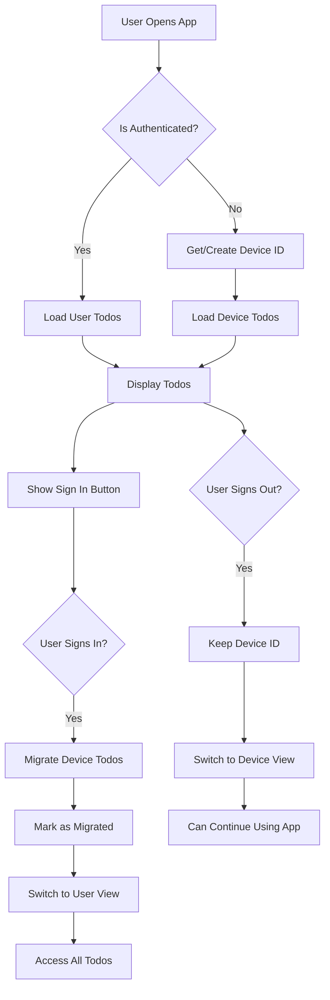

# Todo App Authentication Accessibility & Multi-Device Plan

## Problem Statement

The current implementation has two critical issues:

1. **Lost Todos on Sign Out**: When users sign out, they lose access to all their todos and must create 3 new ones to see the auth prompt again
2. **No Sign In Access**: After signing out, users have no way to sign in again without creating new todos
3. **Multi-Device Confusion**: Todos created on different devices before authentication aren't properly handled

## Solution Overview

This plan implements a comprehensive solution that:
- Preserves device-specific todos after sign out
- Provides persistent authentication access
- Handles multi-device scenarios gracefully
- Maintains a smooth user experience across all states

## Architecture Design

### Core Concepts

1. **Persistent Device Identity**
   - Each device maintains a permanent unique ID
   - Device ID survives authentication cycles
   - Enables continuity for anonymous users

2. **Dual Todo Storage**
   - Anonymous todos: Associated with device_id
   - Authenticated todos: Associated with user_id
   - Clean separation prevents confusion

3. **Smart Migration**
   - Copy (not move) todos on sign in
   - Track migrations to prevent duplicates
   - Support multi-device consolidation

### Data Flow



## Database Schema Updates

```sql
-- Add migration tracking to todos table
ALTER TABLE todos 
ADD COLUMN migrated_to_user_id UUID REFERENCES auth.users(id),
ADD COLUMN migration_timestamp TIMESTAMPTZ,
ADD COLUMN original_device_id TEXT;

-- Add indexes for performance
CREATE INDEX idx_todos_device_migration ON todos(device_id, migrated_to_user_id);
CREATE INDEX idx_todos_user_device ON todos(user_id, device_id);
CREATE INDEX idx_todos_migration_status ON todos(migrated_to_user_id, migration_timestamp);

-- Update RLS policies
-- Policy for anonymous users (device-based access)
CREATE POLICY "Device todos are viewable by device" ON todos
    FOR SELECT USING (
        auth.uid() IS NULL 
        AND device_id = current_setting('app.device_id', true)
        AND migrated_to_user_id IS NULL
    );

-- Policy for authenticated users (user-based access)
CREATE POLICY "Users can view their own todos" ON todos
    FOR SELECT USING (
        auth.uid() = user_id
    );
```

## UI/UX Updates

### Header Component

```
┌─────────────────────────────────────────────────────┐
│  Todo App                         [Sign In]         │  ← Anonymous user
├─────────────────────────────────────────────────────┤

┌─────────────────────────────────────────────────────┐
│  Todo App                         👤 John Doe ▼     │  ← Authenticated user
├─────────────────────────────────────────────────────┤
                                   │
                                   ├─ Profile
                                   ├─ Settings
                                   └─ Sign Out
```

### Authentication States

1. **Anonymous User (< 3 todos)**
   - Sign In button in header
   - No auth prompt
   - Full app functionality

2. **Anonymous User (≥ 3 todos)**
   - Sign In button in header
   - One-time auth prompt (dismissible)
   - Prompt stored in localStorage

3. **Authenticated User**
   - User profile dropdown in header
   - Sign out option in dropdown
   - No auth prompts

### Auth Prompt Behavior

```typescript
// Show conditions
const shouldShowAuthPrompt = 
  !user &&                                    // Not authenticated
  todos.length >= 3 &&                        // Has enough todos
  !localStorage.getItem('authPromptDismissed_${deviceId}'); // Not dismissed

// Dismissal handling
const handleDismiss = () => {
  localStorage.setItem(`authPromptDismissed_${deviceId}`, 'true');
  setShowAuthPrompt(false);
};
```

## Implementation Details

### 1. Device Service Updates

```typescript
// DeviceService.ts - DO NOT clear device ID on migration
export class DeviceService {
  static getDeviceId(): string {
    let deviceId = localStorage.getItem(this.DEVICE_ID_KEY);
    if (!deviceId) {
      deviceId = `device_${uuidv4()}`;
      localStorage.setItem(this.DEVICE_ID_KEY, deviceId);
    }
    return deviceId;
  }
  
  // Remove clearDeviceId from migration flow
  // Add method to check migration status
  static async getDeviceMigrationStatus(): Promise<boolean> {
    const deviceId = this.getDeviceId();
    const { data } = await supabase
      .from('todos')
      .select('migrated_to_user_id')
      .eq('device_id', deviceId)
      .not('migrated_to_user_id', 'is', null)
      .limit(1);
    
    return data && data.length > 0;
  }
}
```

### 2. Migration Service Updates

```typescript
// MigrationService.ts - Copy instead of move
export class MigrationService {
  static async migrateDeviceToUser(userId: string): Promise<void> {
    const deviceId = DeviceService.getDeviceId();
    
    // Get unmigrated todos for this device
    const { data: deviceTodos, error: fetchError } = await supabase
      .from('todos')
      .select('*')
      .eq('device_id', deviceId)
      .is('migrated_to_user_id', null);
    
    if (fetchError) throw fetchError;
    if (!deviceTodos || deviceTodos.length === 0) return;
    
    // Create copies for user
    const userTodos = deviceTodos.map(todo => ({
      text: todo.text,
      completed: todo.completed,
      user_id: userId,
      original_device_id: deviceId
    }));
    
    const { error: insertError } = await supabase
      .from('todos')
      .insert(userTodos);
    
    if (insertError) throw insertError;
    
    // Mark originals as migrated
    const todoIds = deviceTodos.map(t => t.id);
    const { error: updateError } = await supabase
      .from('todos')
      .update({ 
        migrated_to_user_id: userId,
        migration_timestamp: new Date().toISOString()
      })
      .in('id', todoIds);
    
    if (updateError) throw updateError;
    
    console.log(`Migrated ${deviceTodos.length} todos to user account`);
  }
}
```

### 3. Supabase Service Updates

```typescript
// SupabaseService.ts - Proper filtering based on auth state
export class SupabaseService {
  static async getTodos(): Promise<Todo[]> {
    const { data: { user } } = await supabase.auth.getUser();
    
    let query = supabase.from('todos').select('*');
    
    if (user) {
      // Authenticated: show only user todos
      query = query.eq('user_id', user.id);
    } else {
      // Anonymous: show only unmigrated device todos
      query = query
        .eq('device_id', DeviceService.getDeviceId())
        .is('migrated_to_user_id', null);
    }
    
    const { data, error } = await query.order('created_at', { ascending: false });
    
    if (error) throw error;
    return (data || []).map(this.convertToTodo);
  }
}
```

### 4. App Component Updates

```typescript
// App.tsx - Add persistent sign in button
function App() {
  // ... existing state ...
  
  return (
    <div className="App">
      <header className="app-header">
        <div className="header-content">
          <div>
            <h1>Todo App</h1>
            <p>Stay organized and get things done!</p>
          </div>
          <div className="auth-section">
            {user ? (
              <UserProfile user={user} />
            ) : (
              <button 
                className="sign-in-button"
                onClick={() => setShowAuthModal(true)}
              >
                Sign In
              </button>
            )}
          </div>
        </div>
      </header>
      
      {/* Rest of the app */}
    </div>
  );
}
```

## Multi-Device Scenarios

### Scenario 1: Multiple Anonymous Devices

1. **Device A**: User creates 3 todos
2. **Device B**: User creates 2 todos  
3. **Device A**: User signs in
   - 3 todos from Device A are migrated
   - User sees 3 todos
4. **Device B**: User signs in
   - 2 todos from Device B are migrated
   - User sees 5 total todos (3 + 2)

### Scenario 2: Sign Out After Sign In

1. **Device A**: User signs in (todos migrated)
2. **Device A**: User signs out
   - Device ID preserved
   - Shows 0 todos (migrated ones hidden)
3. **Device A**: User creates 2 new todos
4. **Device A**: User signs in again
   - Only 2 new todos migrated
   - No duplicates created

### Scenario 3: Shared Device

1. **User A**: Creates todos, signs in (migrated)
2. **User A**: Signs out
3. **User B**: Creates new todos (same device)
4. **User B**: Signs in
   - Only User B's todos are migrated
   - User A's todos remain with User A

## Edge Cases & Handling

### 1. Browser Data Cleared
- Device ID lost → New device ID generated
- Previous anonymous todos become inaccessible
- Consider showing "Recover todos" option with email verification

### 2. Simultaneous Sign-ins
- Use database transactions for migration
- Implement optimistic locking
- Show loading state during migration

### 3. Large Todo Lists
- Batch migrations for performance
- Show progress indicator
- Consider background migration

### 4. Offline Scenarios
- Queue migration for when online
- Show sync status clearly
- Maintain local consistency

## Testing Strategy

### Unit Tests
- Device ID persistence
- Migration logic
- Todo filtering by auth state
- Auth prompt display logic

### Integration Tests
- Sign in → Sign out → Sign in flow
- Multi-device migration
- Offline/online transitions
- RLS policy verification

### E2E Tests
- Complete user journey
- Multi-device simulation
- Edge case handling
- Performance under load

## Security Considerations

1. **Device ID Security**
   - Use cryptographically secure IDs
   - No PII in device IDs
   - Regular rotation option

2. **Migration Security**
   - Verify user ownership
   - Audit migration events
   - Prevent unauthorized access

3. **Privacy**
   - Clear separation of user data
   - No cross-device tracking
   - GDPR compliance

## Performance Optimizations

1. **Database Indexes**
   - Index on device_id
   - Index on user_id
   - Composite index for migrations

2. **Query Optimization**
   - Efficient filtering
   - Pagination for large lists
   - Caching strategies

3. **UI Performance**
   - Optimistic updates
   - Debounced operations
   - Virtual scrolling for long lists

## Future Enhancements

1. **Todo Recovery**
   - Email-based recovery
   - Device linking
   - Migration history

2. **Advanced Features**
   - Todo sharing
   - Collaborative lists
   - Cross-device sync indicators

3. **Analytics**
   - Anonymous usage metrics
   - Conversion tracking
   - Performance monitoring

## Implementation Checklist

- [ ] Update database schema with migration fields
- [ ] Modify DeviceService to preserve device IDs
- [ ] Update MigrationService to copy instead of move
- [ ] Add persistent Sign In button to header
- [ ] Update SupabaseService filtering logic
- [ ] Implement auth prompt dismissal tracking
- [ ] Update RLS policies for new schema
- [ ] Add migration status indicators
- [ ] Test all multi-device scenarios
- [ ] Update documentation
- [ ] Deploy database migrations
- [ ] Monitor for issues post-deployment

## Success Metrics

1. **User Retention**
   - Users can seamlessly sign in/out
   - No data loss on authentication changes
   - Smooth multi-device experience

2. **Conversion Rate**
   - Track anonymous → authenticated conversions
   - Monitor auth prompt effectiveness
   - Measure sign-in button usage

3. **Technical Metrics**
   - Migration success rate
   - Query performance
   - Error rates

## Conclusion

This plan provides a comprehensive solution to the authentication accessibility and multi-device challenges. By preserving device identity, providing persistent auth access, and handling migrations intelligently, we create a seamless experience that respects user data and expectations across all usage patterns.