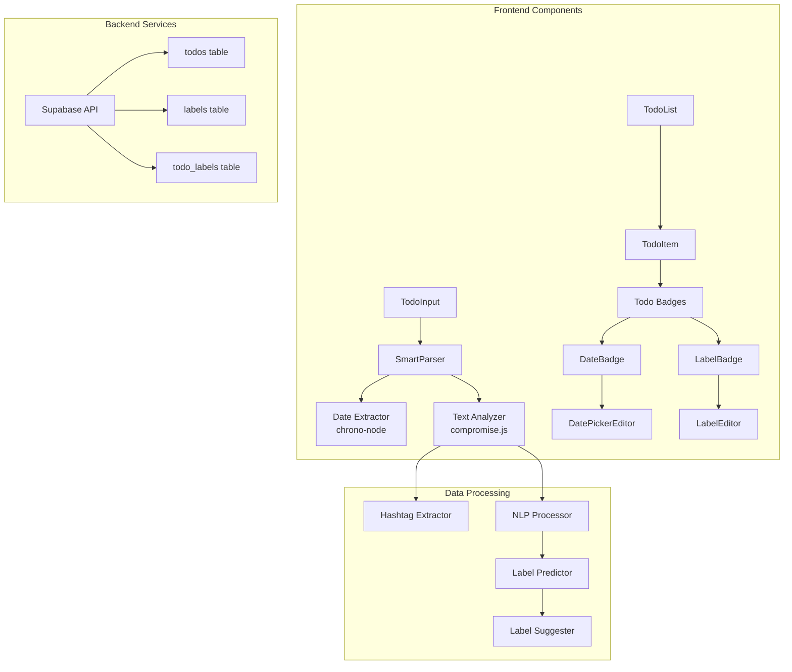

# Todo App Enhancement: Due Date and Labels with Automatic Extraction

## Overview

This plan outlines the implementation of two new features for the todo app:
1. **Due Date Field**: Automatically extracted from natural language in the task description
2. **Label Field**: Extracted from hashtags and predicted using NLP analysis

Both fields will be editable after creation, maintaining the app's clean and intuitive interface.

## Requirements Summary

### Due Date Extraction
- Support natural language dates: "tomorrow", "next Monday", "in 2 days"
- Support specific dates: "May 15", "5/15/2023"
- Support times: "at 3pm", "by 5:30pm"
- Extract and parse dates using chrono-node library

### Label System
- Extract hashtags from text (e.g., #work, #personal) and remove them from displayed text
- Use NLP (compromise.js) to automatically suggest labels when no hashtags present
- Auto-labeling only suggests from existing labels in the system
- Labels based on entity recognition and topic analysis

### UI/UX Design
- Display due dates and labels as small badges/chips below todo text
- Inline editing when clicking on badges (similar to current text editing)
- Maintain clean, minimal design aesthetic

## Technical Architecture

### System Architecture Diagram



### Database Schema Changes

#### 1. Update todos table
```sql
ALTER TABLE todos 
ADD COLUMN due_date TIMESTAMP WITH TIME ZONE,
ADD COLUMN original_text TEXT; -- Store original text with hashtags
```

#### 2. Create labels table
```sql
CREATE TABLE labels (
  id UUID DEFAULT gen_random_uuid() PRIMARY KEY,
  name TEXT NOT NULL UNIQUE,
  color TEXT DEFAULT '#667eea',
  created_at TIMESTAMP WITH TIME ZONE DEFAULT NOW(),
  device_id TEXT,
  user_id UUID REFERENCES auth.users(id),
  CONSTRAINT label_single_owner CHECK (
    (user_id IS NOT NULL AND device_id IS NULL) OR
    (user_id IS NULL AND device_id IS NOT NULL)
  )
);

CREATE INDEX idx_labels_name ON labels(name);
CREATE INDEX idx_labels_device_id ON labels(device_id) WHERE device_id IS NOT NULL;
CREATE INDEX idx_labels_user_id ON labels(user_id) WHERE user_id IS NOT NULL;
```

#### 3. Create todo_labels junction table
```sql
CREATE TABLE todo_labels (
  todo_id UUID REFERENCES todos(id) ON DELETE CASCADE,
  label_id UUID REFERENCES labels(id) ON DELETE CASCADE,
  created_at TIMESTAMP WITH TIME ZONE DEFAULT NOW(),
  PRIMARY KEY (todo_id, label_id)
);

CREATE INDEX idx_todo_labels_todo_id ON todo_labels(todo_id);
CREATE INDEX idx_todo_labels_label_id ON todo_labels(label_id);
```

### Type System Updates

```typescript
// Update existing Todo interface
export interface Todo {
  id: string;
  text: string;
  originalText?: string;  // Text with hashtags preserved
  completed: boolean;
  createdAt: Date;
  updatedAt?: Date;
  dueDate?: Date;
  labels?: Label[];
  syncStatus?: 'synced' | 'pending' | 'error';
}

// New Label interface
export interface Label {
  id: string;
  name: string;
  color: string;
}

// Parsing result interface
export interface ParsedTodoInput {
  text: string;           // Clean text without hashtags/dates
  originalText: string;   // Original input
  dueDate: Date | null;
  extractedLabels: string[];  // From hashtags
  suggestedLabels: LabelSuggestion[];  // From NLP
}

export interface LabelSuggestion {
  label: string;
  confidence: number;
  source: 'hashtag' | 'nlp' | 'user-pattern';
}
```

## Implementation Details

### Phase 1: Database and Backend Setup

1. **Create and run database migrations**
   - Add due_date and original_text to todos
   - Create labels and todo_labels tables
   - Set up RLS policies for new tables

2. **Update Supabase Service**
   ```typescript
   // Enhanced todo creation
   static async createTodo(input: ParsedTodoInput): Promise<Todo> {
     const { data: { user } } = await supabase.auth.getUser();
     
     // Create todo with new fields
     const todoData = {
       text: input.text,
       original_text: input.originalText,
       due_date: input.dueDate,
       completed: false,
       ...(user ? { user_id: user.id } : { device_id: DeviceService.getDeviceId() })
     };
     
     // Insert todo and labels in transaction
     const todo = await this.insertTodoWithLabels(todoData, input.labels);
     return todo;
   }
   ```

### Phase 2: Text Processing Implementation

1. **Install Dependencies**
   ```bash
   npm install chrono-node compromise
   ```

2. **Create SmartTodoParser Service**
   ```typescript
   import chrono from 'chrono-node';
   import nlp from 'compromise';
   
   export class SmartTodoParser {
     parse(input: string): ParsedTodoInput {
       // Extract dates first
       const { text: textWithoutDate, dueDate } = this.extractDate(input);
       
       // Extract hashtags
       const { text: cleanText, hashtags } = this.extractHashtags(textWithoutDate);
       
       // Analyze with NLP if no hashtags found
       const suggestedLabels = hashtags.length === 0 
         ? this.analyzeAndSuggestLabels(cleanText)
         : [];
       
       return {
         text: cleanText,
         originalText: input,
         dueDate,
         extractedLabels: hashtags,
         suggestedLabels
       };
     }
     
     private extractDate(text: string): { text: string; dueDate: Date | null } {
       const results = chrono.parse(text);
       
       if (results.length === 0) {
         return { text, dueDate: null };
       }
       
       // Use the first detected date
       const dateResult = results[0];
       const dueDate = dateResult.start.date();
       
       // Remove date text from input
       const textWithoutDate = text.replace(dateResult.text, '').trim();
       
       return { text: textWithoutDate, dueDate };
     }
     
     private extractHashtags(text: string): { text: string; hashtags: string[] } {
       const hashtagRegex = /#(\w+)/g;
       const hashtags: string[] = [];
       let match;
       
       while ((match = hashtagRegex.exec(text)) !== null) {
         hashtags.push(match[1].toLowerCase());
       }
       
       const cleanText = text.replace(hashtagRegex, '').trim();
       return { text: cleanText, hashtags };
     }
   }
   ```

3. **NLP-based Label Prediction**
   ```typescript
   export class LabelPredictor {
     private existingLabels: Map<string, LabelPattern>;
     
     analyzeAndSuggestLabels(text: string): LabelSuggestion[] {
       const doc = nlp(text);
       const suggestions: LabelSuggestion[] = [];
       
       // Extract entities
       const people = doc.people().out('array');
       const organizations = doc.organizations().out('array');
       const places = doc.places().out('array');
       
       // Extract topics and verbs
       const topics = doc.topics().out('array');
       const verbs = doc.verbs().out('array');
       
       // Match against existing label patterns
       for (const [labelName, pattern] of this.existingLabels) {
         const score = this.calculateMatchScore({
           text,
           people,
           organizations,
           places,
           topics,
           verbs
         }, pattern);
         
         if (score > 0.6) {
           suggestions.push({
             label: labelName,
             confidence: score,
             source: 'nlp'
           });
         }
       }
       
       // Sort by confidence
       return suggestions.sort((a, b) => b.confidence - a.confidence).slice(0, 2);
     }
   }
   ```

### Phase 3: UI Components

1. **Enhanced TodoInput Component**
   ```typescript
   const TodoInput: React.FC<TodoInputProps> = ({ onAddTodo }) => {
     const [inputValue, setInputValue] = useState('');
     const [preview, setPreview] = useState<ParsedTodoInput | null>(null);
     
     // Real-time parsing as user types
     useEffect(() => {
       if (inputValue.trim()) {
         const parsed = SmartTodoParser.parse(inputValue);
         setPreview(parsed);
       } else {
         setPreview(null);
       }
     }, [inputValue]);
     
     return (
       <div className="todo-input-container">
         <form onSubmit={handleSubmit} className="todo-input-form">
           <input
             type="text"
             value={inputValue}
             onChange={(e) => setInputValue(e.target.value)}
             placeholder="What needs to be done?"
             className="todo-input"
           />
           <button type="submit">Add Todo</button>
         </form>
         
         {preview && (
           <TodoInputPreview
             dueDate={preview.dueDate}
             labels={[...preview.extractedLabels, ...preview.suggestedLabels.map(s => s.label)]}
             onRemoveLabel={handleRemoveLabel}
             onChangeDueDate={handleChangeDueDate}
           />
         )}
       </div>
     );
   };
   ```

2. **DateBadge Component**
   ```typescript
   const DateBadge: React.FC<DateBadgeProps> = ({ date, onEdit, onRemove }) => {
     const [isEditing, setIsEditing] = useState(false);
     
     const formatDate = (date: Date) => {
       // Use relative formatting for near dates
       const days = differenceInDays(date, new Date());
       if (days === 0) return 'Today';
       if (days === 1) return 'Tomorrow';
       if (days < 7) return format(date, 'EEEE'); // Day name
       return format(date, 'MMM d');
     };
     
     return (
       <div className="date-badge">
         {isEditing ? (
           <DatePicker
             selected={date}
             onChange={(newDate) => {
               onEdit(newDate);
               setIsEditing(false);
             }}
             onClickOutside={() => setIsEditing(false)}
             inline
           />
         ) : (
           <button
             className="badge-button date"
             onClick={() => setIsEditing(true)}
           >
             📅 {formatDate(date)}
           </button>
         )}
         <button className="badge-remove" onClick={onRemove}>×</button>
       </div>
     );
   };
   ```

3. **LabelBadge Component**
   ```typescript
   const LabelBadge: React.FC<LabelBadgeProps> = ({ label, onEdit, onRemove }) => {
     const [isEditing, setIsEditing] = useState(false);
     
     return (
       <div className="label-badge">
         {isEditing ? (
           <LabelSelector
             currentLabel={label}
             onSelect={(newLabel) => {
               onEdit(newLabel);
               setIsEditing(false);
             }}
             onClickOutside={() => setIsEditing(false)}
           />
         ) : (
           <button
             className="badge-button label"
             style={{ backgroundColor: label.color }}
             onClick={() => setIsEditing(true)}
           >
             {label.name}
           </button>
         )}
         <button className="badge-remove" onClick={onRemove}>×</button>
       </div>
     );
   };
   ```

### Phase 4: Styling

```css
/* Badge styles */
.todo-badges {
  display: flex;
  gap: 8px;
  margin-top: 8px;
  flex-wrap: wrap;
}

.badge-button {
  padding: 4px 12px;
  border: none;
  border-radius: 16px;
  font-size: 12px;
  cursor: pointer;
  transition: all 0.2s ease;
  display: inline-flex;
  align-items: center;
  gap: 4px;
}

.badge-button.date {
  background-color: #e3f2fd;
  color: #1976d2;
}

.badge-button.label {
  color: white;
}

.badge-button:hover {
  transform: translateY(-1px);
  box-shadow: 0 2px 4px rgba(0,0,0,0.1);
}

.badge-remove {
  margin-left: 4px;
  background: none;
  border: none;
  color: inherit;
  cursor: pointer;
  font-size: 16px;
  line-height: 1;
  opacity: 0.7;
}

.badge-remove:hover {
  opacity: 1;
}

/* Input preview */
.todo-input-preview {
  padding: 8px 16px;
  background: #f5f5f5;
  border-radius: 8px;
  margin-top: 8px;
  font-size: 14px;
}

.preview-item {
  display: inline-flex;
  align-items: center;
  margin-right: 12px;
  color: #666;
}
```

## Learning System

### User Pattern Learning

The system will learn from user behavior to improve label predictions:

1. **Track User Actions**
   - When user accepts a suggested label → increase confidence
   - When user changes a suggested label → learn new pattern
   - When user removes a suggested label → decrease confidence

2. **Storage Structure**
   ```typescript
   interface UserPatterns {
     labelPatterns: {
       [label: string]: {
         entities: Map<string, number>;    // entity → frequency
         topics: Map<string, number>;      // topic → frequency
         keywords: Map<string, number>;    // keyword → frequency
         totalExamples: number;
       }
     };
     lastUpdated: Date;
   }
   ```

3. **Privacy Considerations**
   - All learning happens client-side
   - Patterns stored in localStorage
   - User can clear learned patterns
   - Option to disable learning

## Implementation Timeline

### Week 1: Backend & Database
- Day 1-2: Database migrations and schema updates
- Day 3-4: Update Supabase services and types
- Day 5: Testing and migration scripts

### Week 2: Core Features
- Day 1-2: Implement date extraction with chrono-node
- Day 3-4: Implement hashtag extraction and label system
- Day 5: Integrate compromise.js for NLP analysis

### Week 3: UI Components
- Day 1-2: Create badge components (DateBadge, LabelBadge)
- Day 3-4: Update TodoItem and TodoInput components
- Day 5: Implement inline editing features

### Week 4: Polish & Learning
- Day 1-2: Implement user pattern learning
- Day 3: Add filtering by date/labels
- Day 4: Performance optimization
- Day 5: Testing and bug fixes

## Testing Strategy

1. **Unit Tests**
   - Parser functions (date extraction, hashtag extraction)
   - NLP analysis and label prediction
   - Component rendering and interactions

2. **Integration Tests**
   - Full todo creation flow with extraction
   - Inline editing workflows
   - Offline/online synchronization

3. **E2E Tests**
   - Create todos with various date/label formats
   - Edit and update todos
   - Filter and search functionality

## Performance Considerations

1. **Lazy Loading**
   - Load NLP libraries only when needed
   - Use dynamic imports for date picker

2. **Caching**
   - Cache parsed results during typing
   - Memoize expensive NLP operations

3. **Debouncing**
   - Debounce parsing during typing
   - Batch label predictions

## Accessibility

1. **Keyboard Navigation**
   - Tab through badges
   - Enter to edit, Escape to cancel
   - Arrow keys in date picker

2. **Screen Reader Support**
   - Proper ARIA labels for badges
   - Announce changes when editing

3. **Color Contrast**
   - Ensure label colors meet WCAG standards
   - Provide patterns/icons as alternatives

## Future Enhancements

1. **Advanced Features**
   - Recurring tasks based on due dates
   - Label hierarchies (parent/child labels)
   - Smart notifications for due dates

2. **AI Improvements**
   - Fine-tune NLP model with user data
   - Suggest due dates based on task type
   - Priority detection from text

3. **Collaboration**
   - Share labels between users
   - Team label suggestions
   - Label permissions

## Conclusion

This plan provides a comprehensive approach to adding due date and label functionality to the todo app. The use of established libraries (chrono-node for dates, compromise.js for NLP) ensures robust functionality while maintaining the app's simplicity and performance.

The phased implementation allows for iterative development and testing, ensuring each feature is solid before moving to the next. The learning system will improve predictions over time, making the app more intelligent and personalized for each user.